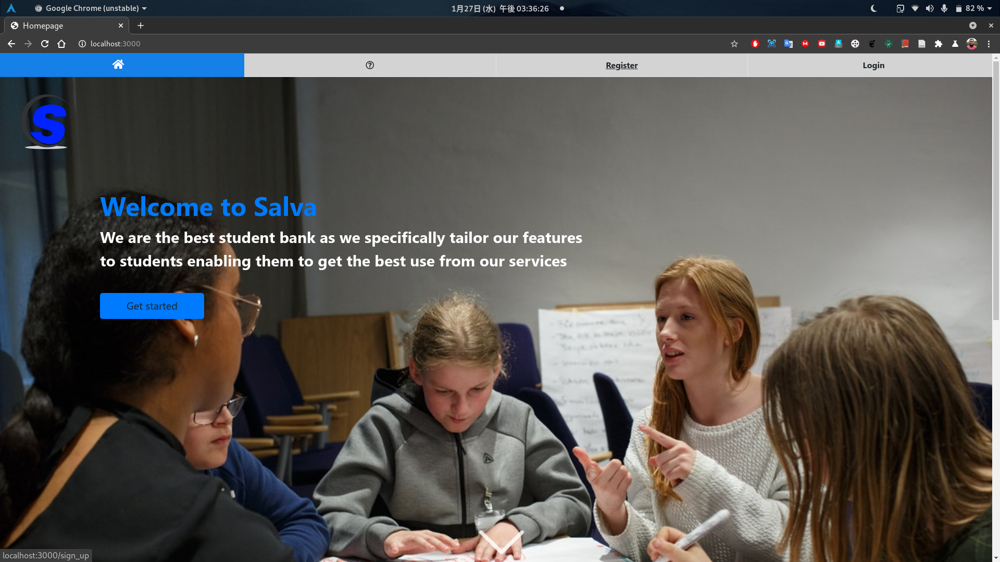
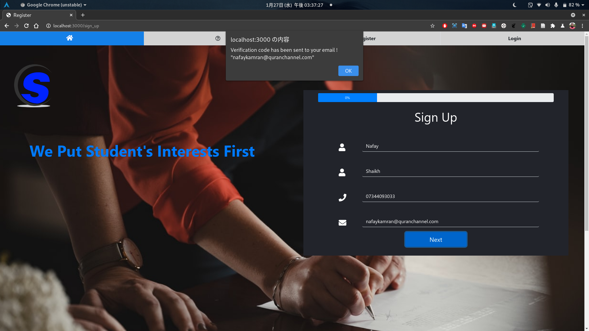
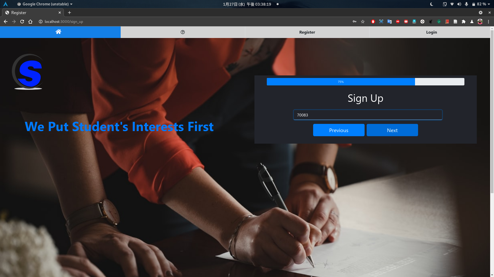

# StuBank PLC: Platform for Students
### Overview
A new banking group made for students is launching in February 2021. StuBank PLC want to break into the banking market for students. They are joining the ever-growing list of online banks and in need of a platform for their customers to do everyday banking. 

 

### Client
This is a fictitious company that has been made for the purposes of this project. [Jordan Barnes](mailto://jordan.barnes@newcastle.ac.uk) will act as a customer for this project. 

 

### Requirements
- Banking functionality i.e. accounts, digital cards, transfers, etc
- Made for students
- Security is a priority i.e. encryption, 2FA, etc
- Machine learning on expenditure
    - tagging of outgoings
    - expenditure
 

### Information on StuBank PLC
As StuBank PLC are a new organisation, they have no branding guidelines. They want something that stands out and is unique.

## Set up

Make sure node.js is installed on your computer then open a terminal and run
```
git clone https://nucode.ncl.ac.uk/scomp/stage-2/csc2033-software-engineering-team-project/teams/Team-13/stubank-plc.git
cd stubank-plc
npm install
```
Then on MacOS or Linux, run the app with this command
```
DEBUG=stubank-plc:* npm start
```
On Windows Command Prompt, use this command
```
set DEBUG=stubank-plc:* & npm start
```
On Windows PowerShell, use this command
```
$env:DEBUG='stubank-plc:*'; npm start
```
You can then open http://localhost:3000/ to access the app.

## Implementation

We have used Express.js, Node.js and a MySQL database to implement the application. For the design of the website we used Bootstrap and the Pug template engine.

## Usage

You will need a real email address in order to create an account as 2 factor authentication is used.

Screenshots of the registration process are shown below:
  

### Development of the System

- The Salva banking web platform includes a user account which allows the student to see their expenditures, transfers, and different accounts which they hold with the bank.
- It allows transfers between these accounts to be both internal and external, with alerts being sent to the users whenever a transaction is made, and includes digital cards for all user accounts
- It ensures maximum security using encryption across networks and two factor authentication
- Machine learning is used to tag purchases into different groups e.g (food, shopping, bills)
- Focuses on the needs of students, as opposed to business accounts:
    - Multiple accounts including current and savings
    - Many small transactions between these
    - A focus on budgeting
    - A system similar to Monzo/Starling is good for both budgeting and small quick transactions

Throughout development we always remembered the target audience of the system. Features added, design/wording choices were made sure to be relevant and appeal to young adults.

### Technical Solution

We implemented a MySQL database which can add students when they join and delete them when they decide to terminate their account. There are also other tables which keep track of transfers/outgoings between accounts and the owner details of each account.
Key factors:
- The system has to comply with GDPR, therefore the storage within the database is encrypted
- For the two factor authentication, An automated code generation is used which is emailed to users.
- The encryption used needed to have high enough bits so that the number of encryption combinations are vast enough. We have used 256 bit which is the standard for banks. RSA encryption is used as asymmetric encryption is more secure
- Machine learning is used in our development so that predictions can be made about what group purchases fall into. Patterns can be identified through the names of shops/companies transferred to/from and the amount of money being transferred. These patterns are be used to group purchases into categories for budgeting and could also be used for collaborations with companies for free joining gifts to gain more users. There are libraries for machine learning that we have looked at that can be used to help us with these ideas.
- Node.js and Express.js are used to program the backend and HTML/CSS/JavaScript/Bootstrap/Pug are used for programming the frontend

### Banking functionality:
- Accounts - current account and saving account
- Page to display account expenditures, transfers, and different accounts they hold with the bank.
- Digital cards 
- Transfers - alerts sent when made
- Encryption and 2FA (automated code generation is emailed to users)
    - Hashed passwords 
    - Email 4 digit number for authentication when you are making a payment
    - Encrypting all of the users important information
- Student account - no interest on your overdraft.
- Personal account - interest on overdraft 
- Student account automatically gets £100
- When the person graduates they are notified they will be switching to a personal account
- Machine learning on expenditures 
    - Save people you have sent money to in the past
    - Trends on expenditures
        - Predict payment categories
        - Ask for pin if it does not match trend e.g. spending too much at one go
    - Keep track of overall spending from all accounts to make sure the bank has enough money and does not go bust

